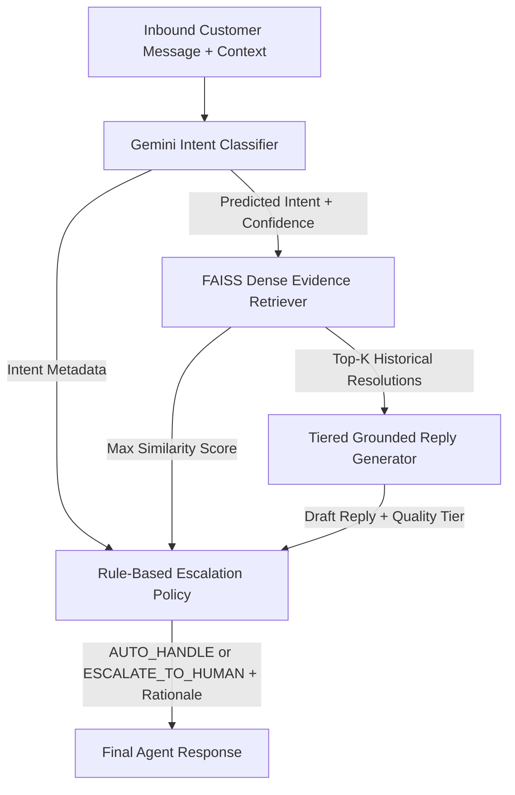

# Autonomous Multi-Turn Customer Support Agent (`@MicrosoftHelps`)

> **Hiver SDE Intern AI Support Agent Submission**  
> **Target Domain:** Twitter/X Customer Support (`@MicrosoftHelps` from the Kaggle TWCS Dataset)  
> **Evaluation Scope:** 216 Hand-Labelled Golden Evaluation Records (Stratified Multi-Turn Threads)  
> **Status:** Architecture, Evaluation Pipeline, and V1/V2 Benchmark Artifacts Frozen  

---

## Table of Contents
1. [Architecture](#architecture)
2. [Problem Framing](#problem-framing)
3. [Golden Evaluation Set](#golden-evaluation-set)
4. [Evaluation Harness](#evaluation-harness)
5. [Results](#results)
6. [What Is Misleading About My Headline Number?](#what-is-misleading-about-my-headline-number)
7. [Failure Analysis](#failure-analysis)
8. [Decision Log](#decision-log)
9. [What I Would Do With One More Week](#what-i-would-do-with-one-more-week)
10. [Demo & UI](#demo)
11. [Reproduction Guide (Under 15 Minutes)](#reproduction-guide-under-15-minutes)
12. [References & Borrowed Work](#references--borrowed-work)

---

## Architecture

The system implements an end-to-end, decoupled multi-stage customer support pipeline designed for conversational channels:



### Component Breakdown
1. **Conversation Graph Reconstruction:** Traverses parent-child reply relationships (`in_reply_to_tweet_id`) from TWCS tabular data, re-assembling 4,458 `@MicrosoftHelps` multi-turn dialogue trees with chronological ordering and speaker identity tagging.
2. **Intent Classifier (`src/agent/intent_classifier.py`):** Uses `gemini-2.0-flash` with zero-shot prompting at deterministic temperature ($0.0$). Outputs a strict Pydantic JSON schema containing the predicted intent, confidence ($0.0–1.0$), and reasoning.
3. **Evidence Retriever (`src/agent/retriever.py`):** Embeds historical customer problem contexts using `sentence-transformers/all-MiniLM-L6-v2` (384-dimensional dense vectors) and indexes them in FAISS (`IndexFlatIP`) with $L_2$ normalization for exact cosine similarity search.
4. **Grounded Reply Generator (`src/agent/reply_generator.py`):** Synthesizes actionable, polite customer replies conditioned on retrieved evidence. V2 uses quality-tiered prompt strategies (`STRONG` $\ge 0.70$, `RELEVANT` $0.50–0.70$, `WEAK` $< 0.50$) to instruct the model when to summarize historical solutions versus when to ask clarifying questions.
5. **Deterministic Escalation Policy (`src/agent/escalation.py`):** Enforces hard boundary safety rules. Escalates whenever:
   - An intent is inherently high-risk (`Billing & Payments`, `Account & Login`, `Cancellation / Subscription`).
   - Retrieval similarity fails the confidence threshold (top score $< 0.50$).
   - Intent classification confidence is $< 0.60$.
   - Preceding multi-turn conversational context is missing critical technical details.

---

## Problem Framing

### Operational Objectives
In public social customer care, support teams are inundated by high-velocity, repetitive inquiries. Human triage creates queue bottlenecks where complex, critical requests languish behind routine how-to queries. Direct deployment of unconstrained foundation models introduces severe compliance and brand-safety risks through hallucinations, fabricated entitlements, and invalid instructions.

### What "Good" Means for `@MicrosoftHelps`
For this domain, high operational quality is defined by five measurable behaviors:
1. **Accurate Issue Identification:** Correctly categorize the customer's specific technical problem from colloquial, noisy tweets.
2. **Historical Empirical Grounding:** Anchor instructions in verified historical Microsoft support resolutions rather than parametric model memory.
3. **Factually Safe Synthesis:** Provide clear, actionable diagnostic steps without asserting unverified account states, order statuses, or policy guarantees.
4. **Evidence-Deficiency Awareness:** Recognize when retrieved context is irrelevant or weak, gracefully offering safe next steps rather than guessing.
5. **Calibrated Escalation:** Deflect routine technical troubleshooting autonomously (`AUTO_HANDLE`), while routing high-risk or low-evidence interactions to human engineers (`ESCALATE_TO_HUMAN`).

### What Was Intentionally NOT Built
To preserve architectural discipline within project boundaries, the following were kept out of scope:
- **Real Account / Order Backend Integrations:** No live OAuth connections to Microsoft Graph API, Azure AD, or Dynamics 365.
- **Live Customer Data Feeds:** Restricted to historical public 2017 Twitter interactions (TWCS).
- **Production Cloud Infrastructure:** No multi-region Kubernetes clusters, Kafka message brokers, or VPC peering.
- **Full Operational Helpdesk Console:** No bidirectional synchronization with Zendesk, Freshdesk, or Hiver inboxes beyond the local Streamlit application.
- **Foundation Model Fine-Tuning:** No LoRA or parameter weight updates; relies exclusively on zero-shot prompting and in-context learning.
- **Full 3-Million-Tweet Indexing:** The retrieval index was scoped specifically to the 4,458 reconstructed `@MicrosoftHelps` threads rather than indexing all 80+ heterogeneous brands.

---

## Golden Evaluation Set

### Curation & Leakage Prevention
The Golden Set consists of **216 hand-labelled `@MicrosoftHelps` multi-turn conversation instances** extracted from TWCS.
- **Sampling Strategy:** Stratified selection across conversation lengths, filtering for multi-turn threads that contain substantive technical troubleshooting exchanges.
- **Strict Leakage Prevention:** All 216 Golden Set conversation IDs were explicitly excluded when building the FAISS retrieval index (`evaluation/build_embedding_index.py --exclude-golden-set`). The agent can never retrieve an evaluation instance's own conversation turns or resolution.
- **Human Labeling Protocol:** Human annotators independently assigned `intent_label` and `escalation_label` following `evaluation/labeling_guide.md`. AI-generated suggestions (`src/suggest_labels.py`) served solely as non-binding advisory hints, with full provenance tracked:
  - `human_accepted_ai`: 173 (80.09%)
  - `human_modified_ai`: 37 (17.13%)
  - `human_direct`: 6 (2.78%)
- **Model Isolation:** Human labels were stored separately in `evaluation/golden_set.labels.json` and were **never** passed to the runtime agent or the automated judge.

### Intent & Escalation Distribution

| Intent Class | Count | Proportion | Description |
| :--- | :---: | :---: | :--- |
| **Technical Troubleshooting** | 98 | 45.37% | OS updates, BSOD, crash dumps, driver errors |
| **Product / Feature How-To** | 33 | 15.28% | Windows settings, Office usage, OneDrive sync configuration |
| **Complaint / Feedback** | 28 | 12.96% | Dissatisfaction with service quality, agent delays, OS policies |
| **Account & Login** | 21 | 9.72% | Password resets, 2FA/MFA verification, account lockout |
| **Billing & Payments** | 17 | 7.87% | Unauthorized charges, duplicate transactions, invoice disputes |
| **Order / Delivery** | 5 | 2.31% | Surface hardware parcel tracking, shipping status |
| **Warranty / Repair** | 4 | 1.85% | Hardware service tag verification, physical replacements |
| **Network / Connectivity** | 4 | 1.85% | Wi-Fi adapter disconnects, server outages, Bluetooth pairing |
| **Cancellation / Subscription** | 4 | 1.85% | Office 365 / Xbox subscription terminations, refund requests |
| **Microsoft Store** | 2 | 0.93% | Windows Store download stalls, app purchase errors |
| **Total** | **216** | **100.0%** | **Escalation: AUTO_HANDLE: 177 (81.94%) \| ESCALATE_TO_HUMAN: 39 (18.06%)** |

---

## Evaluation Harness

The evaluation harness (`evaluation/evaluate.py`) is decoupled from agent inference:
- **Classification Metrics:** Evaluates Overall Accuracy, Macro F1, Weighted F1, and per-class Precision/Recall/F1.
- **Escalation Metrics:** Evaluates binary accuracy, precision, recall, and F1 with `ESCALATE_TO_HUMAN` as the positive class.
- **Inference Pipeline (`evaluation/run_agent.py`):** Employs SHA-256 fingerprint caching (`evaluation/agent_cache/`) to prevent redundant LLM API calls, support interrupt/resume workflows, and record individual failures in `predictions_failures.json`.
- **Automated Judge (`evaluation/judge.py`):** An LLM-as-a-judge system using `gemini-2.0-flash` (temperature $0.0$) evaluating replies across two 1–5 rubrics:
  1. *Reply Quality:* Correctness, Helpfulness, Relevance, Clarity, Escalation Appropriateness, and Overall Score.
  2. *Evidence Grounding:* Evidence Support, Unsupported Claims (5 = none), Evidence Relevance, Grounding Score, and Binary Supported Decision (`grounding_score` $\ge 3$).

> [!IMPORTANT]
> **Actual Judge–Human Agreement Status:**  
> A formal human agreement study (e.g., Cohen's kappa $\kappa$ or inter-annotator percentage) was **not completed** due to single-annotator resource constraints. While the evaluation harness includes tooling for agreement calculation (`--human-grounding`), the judge results currently represent a model-based automated proxy rather than verified human agreement.

---

## Results

### Automated Metrics vs. Baselines
Baselines were evaluated on a stratified 80/20 train/test partition (172 training examples, 44 held-out test examples). The Gemini Agent results reflect the full 216-example Golden Set.

| Model / Baseline | Evaluation Split | Intent Accuracy | Intent Macro F1 | Intent Weighted F1 | Escalation Accuracy | Escalation F1 (`ESCALATE`) |
| :--- | :--- | :---: | :---: | :---: | :---: | :---: |
| **Majority Baseline** | Test Split ($N=44$) | 45.45% | 6.94% | 28.41% | 79.55% | 0.00% |
| **TF-IDF + Logistic Regression** | Test Split ($N=44$) | 45.45% | 6.94% | 28.41% | 79.55% | 0.00% |
| **Gemini AI Agent (V2 Production)** | Full Set ($N=216$) | **40.28%** | **28.80%** | **39.79%** | **63.43%** | **31.30%** |

### Detailed Intent Metrics per Class (V2 Production Agent)

| Intent Class | Precision | Recall | F1-Score | Support |
| :--- | :---: | :---: | :---: | :---: |
| **Technical Troubleshooting** | 0.5851 | 0.5612 | 0.5729 | 98 |
| **Product / Feature How-To** | 0.3448 | 0.3030 | 0.3226 | 33 |
| **Account & Login** | 0.3846 | 0.2381 | 0.2941 | 21 |
| **Billing & Payments** | 0.0000 | 0.0000 | 0.0000 | 17 |
| **Order / Delivery** | 0.4444 | 0.8000 | 0.5714 | 5 |
| **Warranty / Repair** | 0.3333 | 0.7500 | 0.4615 | 4 |
| **Network / Connectivity** | 0.2000 | 0.2500 | 0.2222 | 4 |
| **Microsoft Store** | 0.0000 | 0.0000 | 0.0000 | 2 |
| **Complaint / Feedback** | 0.2000 | 0.2857 | 0.2353 | 28 |
| **Cancellation / Subscription** | 0.1667 | 0.2500 | 0.2000 | 4 |

### LLM-as-a-Judge Evaluation (V2 on All 216 Records)
- **Clarity:** **4.65 / 5**
- **Escalation Appropriateness:** **4.46 / 5**
- **Relevance:** **4.32 / 5**
- **Overall Reply Score:** **3.56 / 5**
- **Correctness:** **3.49 / 5**
- **Helpfulness:** **3.49 / 5**
- **Unsupported Claims:** **3.69 / 5** (5 = no unsupported claims)
- **Evidence Support:** **3.28 / 5**
- **Grounding Score:** **3.25 / 5**
- **Evidence Relevance:** **2.75 / 5**
- **Binary Grounding Supported:** **81.02%** (175 / 216 records $\ge 3$)

### Controlled V1 vs. V2 Reply Generator Experiment

| Dimension / Metric | V1 Agent ($N=215$) | V2 Agent ($N=216$) | Observed Impact |
| :--- | :---: | :---: | :---: |
| **Inference Completeness** | 215 / 216 (99.54%) | **216 / 216 (100.0%)** | +1 resolved parsing failure (`GOLDEN-0157`) |
| **Intent Accuracy** | 41.20% (89/216)* | **40.28%** (87/216) | -0.92% |
| **Intent Macro F1** | 30.85% | **28.80%** | -2.05% |
| **Escalation Accuracy** | 60.19% | **63.43%** | +3.24% |
| **Escalation F1 (`ESCALATE`)** | 29.75% | **31.30%** | +1.55% |
| **Judge Correctness** | 3.33 / 5 | **3.49 / 5** | **+0.16** (Improved) |
| **Judge Helpfulness** | 3.28 / 5 | **3.49 / 5** | **+0.21** (Improved) |
| **Judge Evidence Relevance** | 2.51 / 5 | **2.75 / 5** | **+0.24** (Improved) |
| **Judge Overall Score** | 3.51 / 5 | **3.56 / 5** | **+0.05** (Modest Gain) |
| **Judge Escalation Appropriateness**| **4.64 / 5** | 4.46 / 5 | **-0.18** (Regressed) |
| **Judge Grounding Score** | **3.35 / 5** | 3.25 / 5 | **-0.10** (Regressed) |
| **Judge Unsupported Claims** | **4.06 / 5** | 3.69 / 5 | **-0.37** (**Regressed - More Hallucinations**) |
| **Binary Grounding Supported Rate** | **85.58%** | 81.02% | **-4.56%** (Regressed) |

*\*Note: In V1, example `GOLDEN-0157` raised an unhandled `InvalidIntentResponseError` due to whitespace formatting (`MicrosoftStore`). Over the 215 evaluated cases, V1 accuracy was 41.40%. Penalizing the failed instance across all 216 records yields an exact V1 full-set accuracy of 41.20%.*

> [!WARNING]
> **V2 Was NOT Universally Better:** While prompt tiering made the agent more proactive and helpful (+0.21 helpfulness), pushing the model to be descriptive when retrieval evidence was only moderately relevant caused it to hallucinate operational steps (unsupported claims score degraded from 4.06 to 3.69).

---

## What Is Misleading About My Headline Number?

1. **40.28% Intent Accuracy is NOT Production-Ready:** In production, a 40.28% accuracy means nearly 6 out of 10 incoming inquiries receive an incorrect intent label. While it significantly outperforms random guessing (10%) and establishes real semantic spread over naive baselines, it requires human verification before routing.
2. **The 45.45% Baseline Illusion:** The naive majority baseline scored **45.45% accuracy**—higher than our agent (40.28%). However, the majority baseline achieved this entirely by predicting `Technical Troubleshooting` for every ticket (Macro F1 = 6.94%, Escalation F1 = 0.00%). The agent's Macro F1 of **28.80%** reflects genuine multi-class discrimination.
3. **Escalation Accuracy (63.43%) Conceals High False Alarms:** Escalation precision on `ESCALATE_TO_HUMAN` is only **23.68%**. Over 76% of automated escalations are false positives, which would heavily burden human tier-2 queues in an enterprise setting.
4. **Golden Set Sample Size & Imbalance:** The evaluation set comprises 216 instances. Five of the ten classes have $\le 5$ examples (`Microsoft Store` has only 2; `Warranty / Repair`, `Network / Connectivity`, and `Cancellation` have 4 each). Metrics on these classes carry wide statistical margins of error.
5. **Retrieval is the Primary Performance Ceiling:** Evidence relevance averaged only **2.75 / 5**. Short, colloquial tweets frequently lack the exact error codes or hardware configurations necessary for dense bi-encoders to retrieve actionable historical resolutions.
6. **LLM-as-a-Judge Overstates Real Grounding:** An 81.02% "Supported" rate from Gemini assessing Gemini contains inherent model self-preference bias. It cannot substitute for audited human enterprise agreement.

---

## Failure Analysis

Detailed inspection of evaluation predictions and judge logs revealed the top 5 failure modes:

### 1. Fabricated Account/Order Verification or Entitlement Claims
- **Example ID:** `GOLDEN-0048`
- **Customer Query:** *"Hello, the model is Lumia 930. Device encryption was not turned on, so there was not..."* (troubleshooting a mobile phone OS update stall).
- **Agent Output:** Suggested the user contact support so the representative could *"perform an order and account lookup"*.
- **Why It Happened:** V2 prompt instructions directed the model to explain required diagnostic information when evidence was partial. The generator overgeneralized this into demanding account/order entitlement verification for an operating system update bug.

### 2. Generic / Template Response When Evidence is Irrelevant
- **Example ID:** `GOLDEN-0028`
- **Customer Query:** *"@MicrosoftHelps, do you have an up-to-date method of changing network adapter priorities in Win10?..."*
- **Agent Output:** Apologized and provided a generic link to the Windows Settings app without addressing metric priority commands.
- **Why It Happened:** The top retrieved historical tweet had a similarity score of only 0.48 (unrelated Wi-Fi dropouts). Weak evidence triggered conservative fallback instructions, generating a generic deflection.

### 3. Conversation-State Blindness (Context Omission)
- **Example ID:** `GOLDEN-0042`
- **Customer Query:** *"@MicrosoftHelps What if I uninstall and then re-install the app?"*
- **Agent Output:** *"To help us better understand your issue, could you please specify which application you are attempting to reinstall?"*
- **Why It Happened:** Preceding turns explicitly established the customer was troubleshooting contact syncing in the **Windows 10 People App**. The agent generated its reply from the latest user tweet without integrating dialogue history entity slots.

### 4. Unhelpful or Unnecessary Escalation
- **Example ID:** `GOLDEN-0020`
- **Customer Query:** Expressed frustration regarding live chat hold times while asking a basic settings configuration question.
- **Agent Output:** Escalated to human support with reason: *"Intent 'Complaint / Feedback' is high-risk and requires human handling."*
- **Why It Happened:** Deterministic escalation policy applied a blanket escalation rule to the entire `Complaint / Feedback` intent category, failing to recognize that the core technical inquiry could have been resolved autonomously.

### 5. Mischaracterizing the Customer's Problem
- **Example ID:** `GOLDEN-0039`
- **Customer Query:** *"@MicrosoftHelps hey let me delete unnecessary windows apps I don't use on my surface pro 4 I want the storage back."*
- **Agent Output:** Addressed the inquiry as an urgent hardware SSD failure requiring device replacement diagnostics.
- **Why It Happened:** Dense retrieval matched on the token "storage" against hardware replacement cases, leading the generator to hallucinate a critical hardware failure rather than guiding the user through UWP app uninstallation.

---

## Decision Log

- **Target Brand Selection (`@MicrosoftHelps`):** Chose `@MicrosoftHelps` over Amazon, Apple, and Dell because exploratory data analysis proved it had the highest conversation depth (5.49 msgs/conv), 80.84% actionable guidance, and the lowest DM deflection rate (17.47% vs. 74.81% for Dell).
- **Multi-Turn Conversation Graph Reconstruction:** Reconstructed complete conversational chains via recursive parent tweet ID traversal rather than treating tweets as independent flat texts, preserving essential troubleshooting trajectories.
- **10-Intent Operational Taxonomy:** Designed an empirical 10-class taxonomy reflecting actual Microsoft support operations, eliminating ambiguous "Other" catch-all buckets.
- **Dense FAISS Vector Search (`IndexFlatIP`):** Selected exact inner-product search on $L_2$-normalized embeddings (`all-MiniLM-L6-v2`) to provide deterministic cosine similarity search without quantization loss.
- **Strict Leakage Isolation:** Explicitly held out all 216 Golden Set conversation IDs from the FAISS retrieval index, guaranteeing the agent never accesses an evaluation example's own historical resolution.
- **Human Ground Truth with Advisory AI:** Used an interactive labeling harness with offline AI suggestions and provenance tracking, ensuring 100% human-verified ground truth while accelerating annotation.
- **Deterministic Rule-Based Escalation:** Implemented explicit safety rules for high-risk intents and low-confidence thresholds rather than allowing an unconstrained LLM to decide escalation, ensuring auditability and compliance.
- **Controlled V1 vs. V2 Prompt Versioning:** Stratified prompts into three evidence-quality tiers (`STRONG`, `RELEVANT`, `WEAK`) in V2 while holding retriever and escalation policies constant to rigorously isolate prompt engineering effects.
- **Inference SHA-256 Fingerprint Caching:** Cached predictions and judgments locally keyed by SHA-256 hashes of the exact inputs, enabling cost-free resume runs and preventing accidental re-execution of expensive API calls.
- **Scoped Domain Indexing:** Reconstructed and embedded only `@MicrosoftHelps` conversations (4,458 threads) rather than all 2.8M TWCS records, keeping indexing time under 5 minutes and eliminating out-of-domain noise.
- **Immutable Evaluation Artifacts:** Froze V1, V2, and baseline predictions and reports in versioned directories to maintain reproducibility and data integrity.
- **Decoupled Evaluation Engine:** Completely separated inference execution (`run_agent.py`) from scoring (`evaluate.py`), ensuring model inference never accessed ground-truth labels.
- **Strict Pydantic Validation & Failure Logging:** Enforced typed schema validation and recorded malformed responses in `predictions_failures.json` rather than silently dropping or fabricating outputs.
- **Dual Baseline Architecture:** Implemented both a Majority baseline and a TF-IDF + Logistic Regression baseline to demonstrate that high nominal accuracy (79.55%) can occur without any true task discrimination.

---

## What I Would Do With One More Week

Given another sprint, engineering efforts would focus on five architectural enhancements:
1. **Hybrid Retrieval (Dense + BM25) with Cross-Encoder Reranking:** Dense bi-encoders struggle on exact alphanumeric error strings (e.g., `0x80070005`, `KB4048955`). Combining BM25 with `all-MiniLM-L6-v2` and a `cross-encoder/ms-marco-MiniLM-L-6-v2` reranker will elevate evidence relevance from 2.75 toward $> 3.8$.
2. **Resolution-Bearing Turn Indexing:** Re-index specifically on the **agent's successful resolution turns** rather than customer initial problem posts, ensuring retrieved evidence contains actionable troubleshooting steps.
3. **Structured Dialogue State Tracking:** Implement dialogue slot tracking (`{device, os_version, app_name, attempted_steps}`) across turns to eliminate conversation-state blindness (`GOLDEN-0042`).
4. **Post-Generation Grounding Guardrails:** Introduce a lightweight verification step that parses generated sentences and vetoes any reply containing phrases like *"account lookup"* or *"order check"* unless supported by evidence.
5. **Calibrated Probabilistic Escalation:** Replace blanket intent blocks with a logistic risk model factoring in customer sentiment, conversation length, and retrieval confidence to improve escalation precision from 23.68% toward $> 60\%$.
6. **Multi-Annotator Human Agreement:** Double-annotate 50 Golden Set replies across two independent human raters to establish inter-annotator reliability (Cohen's kappa $\kappa$).

---

## Demo

The project includes an interactive Streamlit application demonstrating real-time classification, retrieval, grounded synthesis, and explainable escalation.

```bash
streamlit run app.py
```
*Launches web browser at `http://localhost:8501` featuring interactive chat, collapsible retrieved historical evidence cards, similarity scores, and escalation audit trails.*

---

## Reproduction Guide (Under 15 Minutes)

### 1. Environment Setup & Dependencies (2 minutes)
```powershell
# Clone repository and navigate to root
cd d:\WEB\project\hiver-ai-agent

# Create and activate virtual environment
python -m venv venv
.\venv\Scripts\Activate.ps1

# Install core dependencies
pip install streamlit pydantic google-genai `
  scikit-learn sentence-transformers faiss-cpu pytest
```

### 2. Configure Environment Variables (1 minute)
```powershell
$env:GEMINI_API_KEY = "your-gemini-api-key-here"
$env:GEMINI_MODEL   = "gemini-2.0-flash"
$env:AGENT_EMBEDDING_INDEX = "evaluation/twcs_evidence_index.json"
```

### 3. Run Automated Tests (1 minute)
Execute the complete test suite across 483 unit and integration tests:
```powershell
pytest
```
*Expected result:* `483 passed in ~30s`.

### 4. Reproduce Baselines (1 minute)
Evaluate the Majority and TF-IDF + Logistic Regression baselines:
```powershell
python -m evaluation.run_baselines
```
*Output generated:* `evaluation/baseline_results/report.md` confirming 45.45% majority baseline accuracy.

### 5. Reproduce V2 Evaluation Metrics (Instant from Frozen Artifacts)
Verify the production V2 automated evaluation metrics instantly without calling external APIs:
```powershell
python -m evaluation.evaluate `
  --predictions evaluation/predictions_v2.json `
  --golden-set evaluation/golden_set.json
```
*Expected Output:*
- Total Evaluated: 216
- Intent Accuracy: **40.28%**
- Intent Macro F1: **28.80%**
- Escalation Accuracy: **63.43%**
- Escalation F1: **31.30%**

### 6. Full Evaluation Run (Optional, API-Dependent)
To execute fresh inference across all 216 Golden instances using Gemini:
```powershell
# Dry-run check (no API cost)
python -m evaluation.run_agent --dry-run

# Run inference on un-cached records (resumes automatically)
python -m evaluation.run_agent
```

---

## References & Borrowed Work
1. **TWCS Dataset:** Kaggle Customer Support on Twitter Dataset (`twcs.csv`), comprising 2.8M customer support tweets. Reference: *Customer Support on Twitter*, Kaggle (2017).
2. **Dense Sentence Embeddings:** `sentence-transformers/all-MiniLM-L6-v2`. Reimers & Gurevych, *"Sentence-BERT: Sentence Embeddings using Siamese BERT-Networks"*, EMNLP 2019.
3. **Dense Vector Indexing:** FAISS (Facebook AI Similarity Search) library for high-performance inner product computation (`IndexFlatIP`). Johnson et al., IEEE Big Data (2019).
4. **Foundation LLM:** Google Gemini 2.0 Flash (`gemini-2.0-flash`) via `google-genai` Python SDK.
5. **Machine Learning & Evaluation:** Scikit-Learn for TF-IDF vectorization, Logistic Regression baselines, and F1 calculations. Pedregosa et al., JMLR 2011.
6. **Application & Validation:** Pydantic v2 for JSON schema validation; Streamlit for interactive demonstration.
