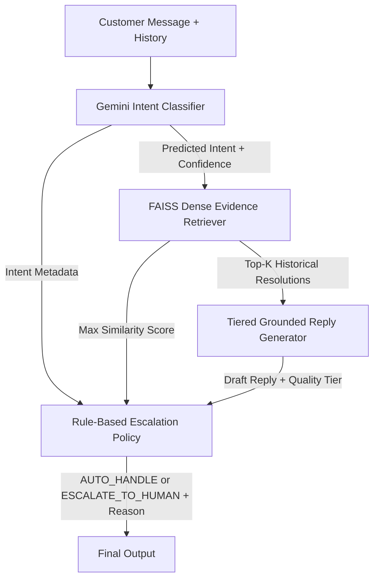

# MicrosoftHelps AI Support Agent

An autonomous multi-turn customer support agent for `@MicrosoftHelps` (Kaggle TWCS dataset) combining zero-shot Gemini intent classification, dense FAISS retrieval of verified historical resolutions, tiered grounded response generation, and rule-based escalation.

### Key Results

| Metric | Value | Scope / Details |
| :--- | :---: | :--- |
| **Golden Evaluation Set** | 216 | Hand-labelled, leakage-isolated multi-turn threads |
| **V2 Intent Accuracy** | 40.28% | Macro F1: 28.80%, Weighted F1: 39.79% |
| **V2 Escalation Accuracy** | 63.43% | F1: 31.30%, Precision: 23.68%, Recall: 46.15% |
| **LLM Judge Overall Score** | 3.56 / 5 | Clarity: 4.65, Grounding: 3.25, Relevance: 4.32 |

## Architecture



- **Conversation Graph Reconstruction:** Reconstructs 4,458 `@MicrosoftHelps` multi-turn dialogue trees via parent-tweet traversal.
- **Intent Classifier (`src/agent/intent_classifier.py`):** Uses `gemini-2.0-flash` (temperature 0.0) with Pydantic schema validation across 10 support intents.
- **Evidence Retriever (`src/agent/retriever.py`):** Dense vector index using `all-MiniLM-L6-v2` embeddings (384-d) and FAISS `IndexFlatIP` exact cosine similarity.
- **Tiered Reply Generator (`src/agent/reply_generator.py`):** Synthesizes grounded replies conditioned on retrieval quality tiers (`STRONG` $\ge 0.70$, `RELEVANT` $0.50–0.70$, `WEAK` $< 0.50$).
- **Deterministic Escalation Policy (`src/agent/escalation.py`):** Flags high-risk intents (Billing, Account, Cancellation) or low-confidence/low-similarity cases for human routing.

## Problem Framing

- **Support Problem:** High-volume public Twitter inquiries overwhelm tier-1 support teams. Deploying unconstrained LLMs directly introduces major brand-safety risks through hallucinations, policy violations, and ungrounded commitments.
- **What "Good" Means:** Accurately triaging user problems, grounding troubleshooting in historical verified solutions, asking clarifying questions when evidence is weak, and safely escalating high-risk account or low-confidence issues.
- **What Was Intentionally Not Built:** Live ticketing/CRM synchronization (Zendesk/Freshdesk), live account backend integrations (OAuth/billing APIs), fine-tuned model weights, and indexing brands beyond `@MicrosoftHelps`.

## Golden Evaluation Set

- **Dataset Size & Sampling:** 216 multi-turn `@MicrosoftHelps` conversations sampled across interaction lengths, focused on substantive technical troubleshooting.
- **Human Labeling:** Annotated using `evaluation/labeling_guide.md`. Annotations were human-verified (80.1% accepted AI suggestion, 17.1% modified AI, 2.8% direct human entry).
- **Label Separation:** Ground-truth labels are stored in `evaluation/golden_set.labels.json` and isolated from runtime inference and LLM judges.
- **Leakage Prevention:** All 216 Golden Set conversation IDs were strictly excluded when building the FAISS retrieval index (`evaluation/twcs_evidence_index.json`).

| Intent Category | Count | Prop. | Escalation Ground Truth | Count | Prop. |
| :--- | :---: | :---: | :--- | :---: | :---: |
| Technical Troubleshooting | 98 | 45.37% | AUTO_HANDLE | 177 | 81.94% |
| Product / Feature How-To | 33 | 15.28% | ESCALATE_TO_HUMAN | 39 | 18.06% |
| Complaint / Feedback | 28 | 12.96% | **Total** | **216** | **100%** |
| Account & Login / Billing | 38 | 17.59% | *Note: 5 minority classes have $\le 5$ examples each.* | | |
| Other 5 Minority Classes | 19 | 8.80% | | | |

## Evaluation Harness

- **Automated Evaluator (`evaluation/evaluate.py`):** Computes overall accuracy, Macro/Weighted F1 for 10 intents, and binary escalation precision/recall/F1 (`ESCALATE_TO_HUMAN` as positive class).
- **Inference Harness (`evaluation/run_agent.py`):** Uses SHA-256 caching (`evaluation/agent_cache/`) for idempotent runs and logs invalid outputs to `predictions_failures.json`.
- **LLM-as-a-Judge (`evaluation/judge.py`):** `gemini-2.0-flash` evaluates reply quality (Correctness, Helpfulness, Relevance, Clarity, Escalation) and evidence grounding (Support, Unsupported Claims) on 1–5 scales.
- **Judge-Human Agreement Status:** A formal double-annotated human-vs-judge agreement study was **not completed** due to resource constraints. The LLM judge scores serve as automated proxies and should be viewed with model self-preference awareness.

## Results

### Main Comparison Table

| System | Split | Intent Accuracy | Macro F1 | Escalation Accuracy | Escalation F1 |
| :--- | :--- | :---: | :---: | :---: | :---: |
| **Majority Baseline** | Test Split ($N=44$) | 45.45% | 6.94% | 79.55% | 0.00% |
| **TF-IDF + Logistic Regression** | Test Split ($N=44$) | 45.45% | 6.94% | 79.55% | 0.00% |
| **Gemini AI Agent (V2)** | Full Set ($N=216$) | **40.28%** | **28.80%** | **63.43%** | **31.30%** |

*Note on Splits:* Baselines were trained and tested on an 80/20 train/test split (44 test instances). The Gemini Agent evaluates zero-shot across all 216 Golden instances. The agent's lower raw accuracy is not a regression against baselines; the majority baseline blindly predicted the single dominant class (`Technical Troubleshooting`), yielding 0% F1 on all minority intents and escalations.

*Per-Class Intent Summary:* The V2 agent achieves solid discrimination on majority classes (`Technical Troubleshooting` F1: 0.57, `Product How-To` F1: 0.32, `Order/Delivery` F1: 0.57), but struggled on low-support classes (`Billing & Payments` and `Microsoft Store` F1: 0.00) due to conversational ambiguity and limited training signals.

### Controlled V1 vs. V2 Reply Generator Experiment

| Metric | V1 Agent ($N=215$) | V2 Agent ($N=216$) | Delta / Impact |
| :--- | :---: | :---: | :---: |
| **Inference Completeness** | 99.54% (1 parse error) | **100.0%** (0 errors) | +1 resolved parse failure (`GOLDEN-0157`) |
| **Judge Helpfulness / Correctness** | 3.28 / 3.33 | **3.49 / 3.49** | **+0.21 / +0.16** (More proactive advice) |
| **Judge Evidence Relevance** | 2.51 / 5 | **2.75 / 5** | **+0.24** (Better context handling) |
| **Judge Unsupported Claims** (5=best) | **4.06 / 5** | 3.69 / 5 | **-0.37** (Regressed: increased hallucinations) |
| **Binary Grounding Supported Rate** | **85.58%** | 81.02% | **-4.56%** (Trade-off for proactivity) |

## What Is Misleading About My Headline Number?

1. **40.28% Intent Accuracy is Not Production-Ready:** Nearly 6 out of 10 customer inquiries receive an inaccurate intent classification, requiring manual review before automated routing.
2. **Majority Baseline Reaches 45.45%:** Raw accuracy alone is deceptive because predicting `Technical Troubleshooting` for every ticket yields higher accuracy than the agent, despite failing all minority classes (Macro F1 = 6.94%).
3. **Minority Classes Have Very Small Support:** Five of the 10 intents have $\le 5$ examples in the 216-item set (`Microsoft Store` has only 2), making per-class metrics sensitive to single-case variance.
4. **LLM Judge Metrics Lack Human Agreement:** An 81.02% grounding rate and 3.56/5 overall score are model-based evaluations using Gemini to judge Gemini, without audited human inter-rater reliability.

## Failure Analysis

1. **Fabricated Entitlement & Account Lookup Claims (`GOLDEN-0048`):**
   - *Customer Query:* Lumia 930 device encryption and OS update stall.
   - *Agent Behavior:* Recommended contacting support so the agent could "perform an order and account lookup".
   - *Cause:* Prompting the model to be helpful under partial evidence led it to invent transactional account lookup procedures for an OS bug.
2. **Generic Template Deflection Under Weak Evidence (`GOLDEN-0028`):**
   - *Customer Query:* Asking for Windows 10 network adapter metric priority settings.
   - *Agent Behavior:* Provided a generic link to Windows Settings without addressing adapter metrics.
   - *Cause:* Top FAISS retrieval score was low (0.48), triggering conservative fallback templates instead of technical guidance.
3. **Conversation Context Blindness (`GOLDEN-0042`):**
   - *Customer Query:* "What if I uninstall and then re-install the app?"
   - *Agent Behavior:* Asked the user which application they were referring to.
   - *Cause:* The agent only evaluated the latest turn, losing preceding thread context that explicitly identified the Windows 10 People App.
4. **Blanket Escalation on Non-Critical Inquiries (`GOLDEN-0020`):**
   - *Customer Query:* Expressed mild frustration about wait times while asking a basic configuration question.
   - *Agent Behavior:* Escalated to human with reason: `Complaint / Feedback is high-risk`.
   - *Cause:* Static intent-level escalation policies blindly escalate the entire category, missing resolvable technical issues.
5. **Entity Confusion from Lexical Overlap (`GOLDEN-0039`):**
   - *Customer Query:* How to delete unused apps on Surface Pro 4 to reclaim storage.
   - *Agent Behavior:* Treated the ticket as an urgent hardware SSD failure requiring device replacement.
   - *Cause:* Dense retrieval matched the keyword "storage" to hardware replacement cases, biasing generation away from app uninstallation.

## Decision Log

- **Target Brand Selection (`@MicrosoftHelps`) — Why:** Selected `@MicrosoftHelps` due to deepest conversation trees (5.49 msgs/thread) and lowest DM deflection rate (17.5% vs 74.8% for Dell).
- **Conversation Graph Assembly — Why:** Reconstructed multi-turn dialogue trees via `in_reply_to_tweet_id` to preserve full troubleshooting context.
- **Empirical 10-Intent Taxonomy — Why:** Built an operational taxonomy matching real Microsoft support categories instead of arbitrary clusters or an unhelpful "Other" category.
- **FAISS Dense Cosine Indexing (`IndexFlatIP`) — Why:** Used $L_2$-normalized `all-MiniLM-L6-v2` embeddings for exact, deterministic vector similarity search without quantization loss.
- **Strict Retrieval Leakage Isolation — Why:** Excluded all 216 Golden Set conversation IDs from the FAISS vector index to prevent the agent from retrieving its own evaluation targets.
- **Human Ground Truth with Advisory AI — Why:** Human annotators reviewed and verified all labels with full provenance tracking to ensure data integrity while speeding up annotation.
- **Deterministic Rule-Based Escalation — Why:** Enforced explicit code-level safety boundaries for high-risk intents and low-similarity thresholds rather than leaving escalation to LLM discretion.
- **Quality-Tiered Reply Prompting (V2) — Why:** Instructed generator behavior across three discrete similarity tiers (`STRONG`, `RELEVANT`, `WEAK`) to systematically isolate prompt changes between V1 and V2.
- **SHA-256 Input Caching — Why:** Cached LLM responses by input hash to guarantee deterministic replay, prevent accidental API spend, and enable instant evaluation reruns.
- **Decoupled Evaluation Harness — Why:** Completely isolated evaluation scoring from inference execution so the agent pipeline never has access to ground-truth labels.
- **Dual Baseline Architecture — Why:** Built both Majority and Logistic Regression baselines to demonstrate that high nominal accuracy can hide a total failure to discriminate classes.
- **Typed Schema Validation with Failure Logging — Why:** Used Pydantic to validate model responses and explicitly log parsing exceptions (`predictions_failures.json`) rather than silently skipping errors.

## What I Would Do With One More Week

1. **Hybrid Retrieval (Dense + BM25) with Cross-Encoder Reranker:** Add lexical matching (BM25) to catch exact alphanumeric error codes (`0x80070005`, `KB4048955`), followed by a cross-encoder reranker; evaluate by measuring change in retrieval MRR@3 and judge evidence relevance.
2. **Resolution-Bearing Turn Indexing:** Re-index historical threads specifically on agent resolution turns rather than customer problem descriptions; evaluate impact on reply correctness and grounding.
3. **Structured Dialogue State Tracking:** Implement dialogue slot-filling (`{device, os_version, app_name}`) across conversation turns to resolve multi-turn reference failures (`GOLDEN-0042`); evaluate intent accuracy on turn $> 1$.
4. **Post-Generation Grounding Guardrails:** Implement a lightweight hallucination veto pass that checks generated claims against retrieved evidence; evaluate reduction in unsupported claims.
5. **Multi-Annotator Human Agreement Study:** Double-annotate 50 Golden Set responses across two human raters to establish Cohen's kappa ($\kappa$) baseline against LLM-as-a-judge scores.

## Demo & UI

The customer-support chatbot interface demonstrates real-time conversational assistance, retrieved evidence cards, and transparent escalation decisions.

```bash
streamlit run app.py
```
*Access at `http://localhost:8501` to test customer inquiries with live classification, historical resolution retrieval, and escalation rationale.*

## Reproduction Guide (Under 15 Minutes)

### 1. Setup Environment & Dependencies (~2 min)
```powershell
python -m venv venv
.\venv\Scripts\Activate.ps1
pip install streamlit pydantic google-genai scikit-learn sentence-transformers faiss-cpu pytest
```

### 2. Configure Environment Variables (~1 min)
```powershell
$env:GEMINI_API_KEY = "your-gemini-api-key-here"
$env:GEMINI_MODEL   = "gemini-2.0-flash"
$env:AGENT_EMBEDDING_INDEX = "evaluation/twcs_evidence_index.json"
```

### 3. Run Unit & Integration Tests (~1 min)
```powershell
pytest
```
*Verifies 483 unit and integration tests.*

### 4. Reproduce Baselines (~1 min)
```powershell
python -m evaluation.run_baselines
```
*Outputs Majority and TF-IDF baseline results to `evaluation/baseline_results/report.md`.*

### 5. Reproduce V2 Evaluation Metrics (Instant from Frozen Artifacts)
```powershell
python -m evaluation.evaluate --predictions evaluation/predictions_v2.json --golden-set evaluation/golden_set.json
```
*Instantly outputs: Intent Accuracy: 40.28%, Macro F1: 28.80%, Escalation Accuracy: 63.43%, Escalation F1: 31.30%.*

### 6. Fresh Gemini Inference (Optional, API-Dependent)
```powershell
python -m evaluation.run_agent --dry-run  # Zero API cost check
python -m evaluation.run_agent            # Executes inference on un-cached records
```

## References & Borrowed Work

- **TWCS Dataset:** Kaggle Customer Support on Twitter (`twcs.csv`), 2017.
- **Sentence Embeddings:** `sentence-transformers/all-MiniLM-L6-v2` (Reimers & Gurevych, EMNLP 2019).
- **Vector Search:** FAISS `IndexFlatIP` (Johnson et al., IEEE Big Data 2019).
- **LLM Engine:** Google Gemini 2.0 Flash (`gemini-2.0-flash`) via `google-genai`.
- **Baselines & Metrics:** Scikit-Learn for TF-IDF, Logistic Regression, and F1 calculations.
